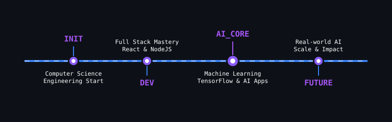

<!-- HERO BANNER -->

<!-- BACKGROUND EFFECTS -->
<picture>
  <source media="(prefers-color-scheme: dark)" srcset="assets/stars.svg">
  
</picture>

<!-- DIVIDER -->

<table>
  <tr>
    <td width="30%" align="center">
      
        
      
        
      
    </td>
    <td width="70%">
      <!-- DASHBOARD SVG -->
      
    </td>
  </tr>
</table>

<!-- DIVIDER -->

### <code>&#91; SYSTEM_LOG: ABOUT_ME &#93;</code>

  <blockquote>
    
<i>"Building AI that solves real-world problems."</i>

  </blockquote>
  

    > <b>ACCESS_LEVEL:</b> ROOT 
    > <b>LOCATION:</b> INDIA [GEO_NODE_ACTIVE] 
    > <b>CURRENT_DIRECTIVE:</b> Engineering state-of-the-art AI systems and crafting resilient Full-Stack architectures. Passionate about bringing intelligent solutions to mobile platforms and the web, utilizing scalable cloud technologies. 
    > <b>COMPUTATION_TARGETS:</b> TensorFlow Lite, FastAPI, React Native, AWS 
  

<!-- DIVIDER -->

### <code>&#91; MODULES: TECH_STACK &#93;</code>

  

    
  

 

<!-- SKILL MATRIX -->

<!-- DIVIDER -->

### <code>&#91; ARCHIVE: FEATURED_PROJECTS &#93;</code>

<table width="100%">
  <!-- ROW 1 -->
  <tr>
    <td width="50%" valign="top">
      <h3 align="center">SpendGuard AI</h3>
      
<i>Offline-first AI personal finance manager</i>

      <ul>
        <li><b>Engine:</b> React Native, SQLite</li>
        <li><b>AI Module:</b> TensorFlow Lite</li>
        <li><b>Feature:</b> Fraud Detection Engine</li>
      </ul>
      

        
      

    </td>
    <td width="50%" valign="top">
      <h3 align="center">AI Hospital System</h3>
      
<i>Smart scheduling & predictive medical management</i>

      <ul>
        <li><b>Engine:</b> React, FastAPI, MongoDB</li>
        <li><b>AI Module:</b> Groq AI Chatbot</li>
        <li><b>Feature:</b> Queue Prediction Algorithms</li>
      </ul>
      

        
      

    </td>
  </tr>
  <!-- ROW 2 -->
  <tr>
    <td width="50%" valign="top">
      <h3 align="center">GeoSecure AI</h3>
      
<i>Geo-tagged evidence collection & security</i>

      <ul>
        <li><b>Engine:</b> AWS Cloud Architecture</li>
        <li><b>Sensors:</b> GPS & Real-time Sync</li>
        <li><b>Feature:</b> Secure Data Vault</li>
      </ul>
    </td>
    <td width="50%" valign="top">
      <h3 align="center">VibeSync</h3>
      
<i>Realtime media synchronization platform</i>

      <ul>
        <li><b>Engine:</b> Flutter, Firebase</li>
        <li><b>Core:</b> Watch Together API</li>
        <li><b>Feature:</b> Zero-latency sync</li>
      </ul>
    </td>
  </tr>
</table>

<!-- DIVIDER -->

### <code>&#91; TELEMETRY: STATS & ACTIVITY &#93;</code>

  
  

 

  

<!-- DIVIDER -->

### <code>&#91; GRID: CONTRIBUTION_MATRIX &#93;</code>

<picture>
  <source media="(prefers-color-scheme: dark)" srcset="dist/github-contribution-grid-snake-dark.svg">
  <source media="(prefers-color-scheme: light)" srcset="dist/github-contribution-grid-snake.svg">
  
</picture>

  

<!-- TIMELINE -->

<!-- DIVIDER -->

### <code>&#91; WALL_OF_HONOR: TROPHIES &#93;</code>

  

<!-- DIVIDER -->

### <code>&#91; NETWORK: CONTACT &#93;</code>

  
  
  

  

<!-- FOOTER -->

