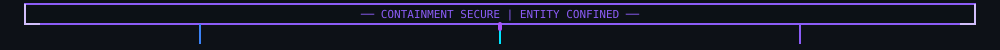
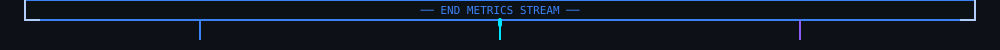

<picture></picture>

<!-- ═══════════════════════════════════════════ -->
<!-- SYSTEM TELEMETRY: GitHub Stats + Languages  -->
<!-- ═══════════════════════════════════════════ -->

<picture></picture>

<table width="100%" cellspacing="0" cellpadding="0" border="0" bgcolor="#0D1117">
  <tr>
    <td width="50%" align="center">
      
    </td>
    <td width="50%" align="center">
      
    </td>
  </tr>
</table>

<picture></picture>

<!-- ═══════════════════════════════════════════ -->
<!-- STREAK ENGINE: Fire Streak                  -->
<!-- ═══════════════════════════════════════════ -->

<picture></picture>

<table width="100%" cellspacing="0" cellpadding="0" border="0" bgcolor="#0D1117">
  <tr>
    <td align="center">
      
    </td>
  </tr>
</table>

<picture></picture>

<!-- ═══════════════════════════════════════════ -->
<!-- CONTRIBUTION MATRIX: Snake Containment      -->
<!-- ═══════════════════════════════════════════ -->

<picture></picture>

<table width="100%" cellspacing="0" cellpadding="0" border="0" bgcolor="#0D1117">
  <tr>
    <td align="center">
      <picture>
        <source media="(prefers-color-scheme: dark)" srcset="https://raw.githubusercontent.com/S-G-Rathenesh/S-G-Rathenesh/output/github-contribution-grid-snake-dark.svg">
        <source media="(prefers-color-scheme: light)" srcset="https://raw.githubusercontent.com/S-G-Rathenesh/S-G-Rathenesh/output/github-contribution-grid-snake.svg">
        
      </picture>
    </td>
  </tr>
</table>

<picture></picture>

<!-- ═══════════════════════════════════════════ -->
<!-- AI CORE METRICS: Detailed Analytics         -->
<!-- ═══════════════════════════════════════════ -->

<picture></picture>

<table width="100%" cellspacing="0" cellpadding="0" border="0" bgcolor="#0D1117">
  <tr>
    <td align="center">
      
    </td>
  </tr>
  <tr>
    <td align="center">
      
    </td>
  </tr>
</table>

<picture></picture>

<!-- ═══════════════════════════════════════════ -->
<!-- BOTTOM LAYER: Timeline + Shutdown           -->
<!-- ═══════════════════════════════════════════ -->

<picture></picture>

  
  
  

